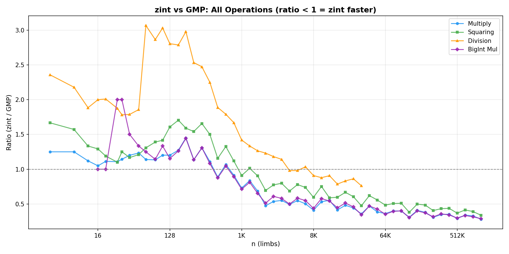
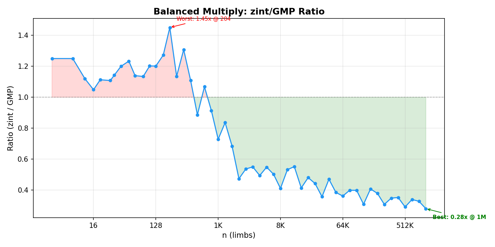
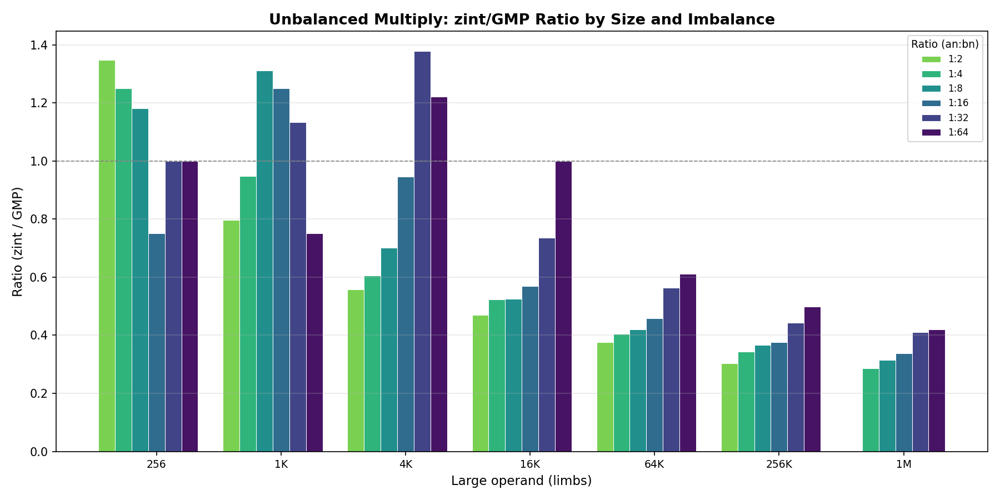
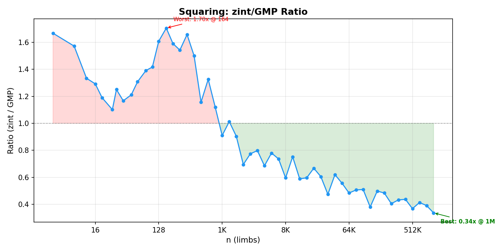
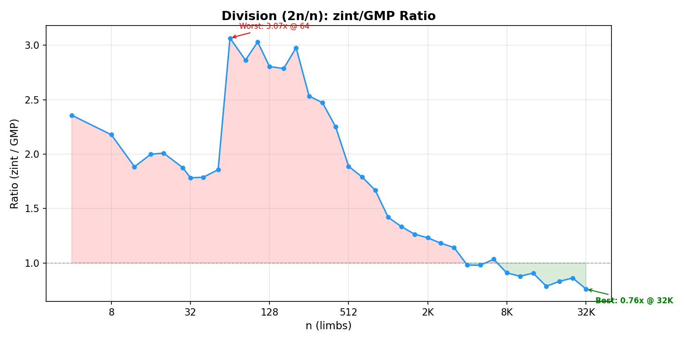
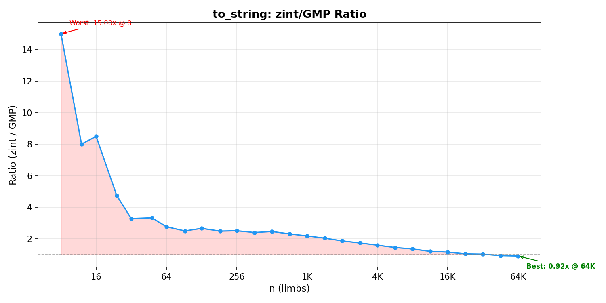
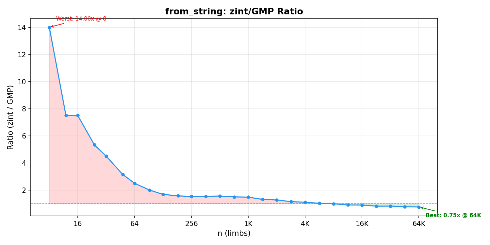

# zint

Header-only arbitrary-precision integer library in C++17 with x86-64 ASM
kernels (ADX/BMI2) and AVX2-accelerated NTT multiplication. ~5,900 SLOC across 35 files (32 C++ headers + 3 ASM kernels).

**Up to 3.6x faster than GMP** for balanced multiply at large sizes; consistently faster from ~512 limbs onward.



## Performance vs GMP

Benchmarked on AMD Zen 4 (single-threaded), compiled with GCC 14.2 `-O2 -mavx2`. GMP 6.3.0 (MSYS2 ucrt64). Sizes up to 1M u64 limbs (8 MB per operand).

### Balanced Multiply (n x n)



| Size | zint | GMP | Ratio |
|------|------|-----|-------|
| 512 | 22 us | 25 us | 0.89x |
| 4K | 200 us | 404 us | **0.49x** |
| 32K | 1.85 ms | 5.18 ms | **0.36x** |
| 131K | 7.9 ms | 25.6 ms | **0.31x** |
| 1M | 75 ms | 266 ms | **0.28x** |

Crossover at ~512 limbs. NTT kicks in at 1K limbs (p30x3 engine), scaling to 3.6x faster.

### Unbalanced Multiply



zint wins even for highly unbalanced multiplications (64:1 ratio) when the large operand exceeds ~16K limbs. At 1M x 16K (1:64), zint is 2.4x faster.

### Squaring



| Size | Ratio | Notes |
|------|-------|-------|
| 256 | 1.54x | GMP has dedicated sqr basecase |
| 2K | **0.69x** | NTT crossover |
| 32K | **0.47x** | |
| 1M | **0.34x** | 2.9x faster |

NTT squaring detects `a == b` pointer equality and skips redundant forward transforms (saves ~33%).

### Division



Division (2n / n) converges around 4K limbs. Newton division reaches 0.76x at 32K limbs.

### Radix Conversion




| Operation | Crossover | At 64K limbs |
|-----------|-----------|--------------|
| to_string | ~46K limbs | **0.91x** |
| from_string | ~8K limbs | **0.75x** |

D&C radix conversion using O(M(n) log n) algorithm. Power-of-2 bases use O(n) bit-extraction.

### addmul_1

The ASM kernel (ADX/BMI2, 4-way unrolled) ties or beats GMP's `mpn_addmul_1` across all sizes.

## Features

- **Sign-magnitude bigint** with full operator overloading (`+`, `-`, `*`, `/`, `%`, `<<`, `>>`, `&`, `|`, `^`, `~`, comparisons)
- **Multiplication chain**: schoolbook basecase (ASM) &rarr; Karatsuba &rarr; NTT, with dedicated squaring paths
- **Division chain**: single-limb Barrett &rarr; schoolbook (Knuth Algorithm D) &rarr; Newton with precomputed reciprocal
- **Radix conversion**: D&C O(M(n) log n) for all bases 2-64; O(n) bit-extraction for power-of-2 bases; LUT-accelerated basecase
- **Two-tier NTT**: `p30x3` (3 &times; 30-bit primes, u32 Montgomery, up to ~12M elements) and `p50x4` (4 &times; 50-bit primes, FP Barrett, unlimited)
- **AVX2 throughout**: bitwise ops, shifts, carry propagation, comparison, NTT butterflies
- **Thread-local bump allocator** (`scratch.hpp`): zero-overhead temp memory via mark/restore
- **ASM kernels**: `addmul_1` (ADX dual-carry, 1.7 cyc/limb on Zen 4), `submul_1`, fused `mul_basecase`; MASM on Windows, GAS on Linux/macOS

## Architecture

### Two NTT Engines

The library selects the faster engine based on operand size:

- **p30x3** (n <= 6M u32 limbs): Three ~30-bit primes, u32 Montgomery arithmetic. Faster for small-to-medium sizes.
- **p50x4** (n > 6M u32 limbs): Four ~50-bit primes, double-precision FMA Barrett arithmetic. Handles arbitrarily large sizes via mixed-radix + Bailey 4-step.

### Three-Prime NTT (p30x3)

| Prime | Value | p - 1 |
|-------|-------|-------|
| P0 | 880803841 | 105 * 2^23 + 1 |
| P1 | 754974721 | 90 * 2^23 + 1 |
| P2 | 377487361 | 45 * 2^23 + 1 |

Product P0 * P1 * P2 ~ 2^88, sufficient for u32 limb convolutions up to 3 * 2^23 elements.

### Four-Prime NTT (p50x4)

| Prime | Value | p - 1 |
|-------|-------|-------|
| P0 | 519519244124161 | 2^39 * 945 + 1 |
| P1 | 750416685957121 | 2^39 * 1365 + 1 |
| P2 | 865865406873601 | 2^39 * 1575 + 1 |
| P3 | 1096762848706561 | 2^39 * 1995 + 1 |

Product ~ 2^196, sufficient for u64 limb convolutions. All primes support NTT sizes up to 5 * 2^39.

### Key Optimizations

- **Twisted convolution**: negacyclic product mod (x^8 - w) via 8-point cyclic convolution within each AVX2 vector, avoiding 2x zero-padding
- **Lazy Montgomery reduction**: intermediates in [0, 4M) range, minimizing modular ops
- **Ruler-sequence root updates**: cache-friendly blocked traversal, no root table lookups
- **Bailey 4-step** (p50x4): cache-oblivious transpose + 4x-unrolled twiddle for large transforms
- **ADX/BMI2 ASM kernels**: hand-written addmul_1 (~1.7 cyc/limb), submul_1, mul_basecase
- **NTT squaring**: detects self-multiply, skips redundant forward transform (saves ~33%)
- **Karatsuba squaring**: recursive a^2 path (saves ~33% per level vs generic a*b)

## Quick start

zint is header-only (plus a small ASM static library). Include a single header:

```cpp
#include "zint/zint.hpp"

int main() {
    zint::bigint a("123456789012345678901234567890");
    zint::bigint b("987654321098765432109876543210");
    zint::bigint c = a * b;
    std::cout << c.to_string() << "\n";       // base 10
    std::cout << c.to_string(16) << "\n";     // base 16
    return 0;
}
```

## Building

### Requirements

- C++17 compiler with AVX2 support (MSVC, GCC, or Clang)
- x86-64 target with ADX and BMI2 (Intel Broadwell+ / AMD Zen+)
- Assembler: MASM (`ml64`) on Windows, GAS (`as`) on Linux/macOS

### CMake (all platforms)

```bash
cmake -B build -DCMAKE_BUILD_TYPE=Release
cmake --build build
```

CMake automatically selects the right assembler and ABI:
- **Windows/MSVC**: MASM (`.asm` files, Windows x64 ABI)
- **Linux/macOS**: GAS (`.S` files, System V ABI)

### MSVC (manual)

```powershell
# Assemble kernels:
ml64 /nologo /c /Fo zint\asm\addmul_1_adx.obj zint\asm\addmul_1_adx.asm
ml64 /nologo /c /Fo zint\asm\submul_1_adx.obj zint\asm\submul_1_adx.asm
ml64 /nologo /c /Fo zint\asm\mul_basecase_adx.obj zint\asm\mul_basecase_adx.asm

# Compile and link:
cl /std:c++17 /O2 /EHsc /arch:AVX2 your_program.cpp zint\asm\*.obj
```

### GCC / Clang (manual)

```bash
# Assemble kernels:
gcc -c -mavx2 -mbmi2 -madx -o addmul_1_adx.o zint/asm/addmul_1_adx.S
gcc -c -mavx2 -mbmi2 -madx -o submul_1_adx.o zint/asm/submul_1_adx.S
gcc -c -mavx2 -mbmi2 -madx -o mul_basecase_adx.o zint/asm/mul_basecase_adx.S

# Compile and link:
g++ -std=c++17 -O2 -mavx2 -mbmi2 -madx your_program.cpp *.o -o your_program
```

### Benchmark vs GMP (MSYS2)

```bash
g++ -std=c++17 -O2 -mavx2 -mbmi2 -madx -mfma -I.. -static \
    bench/bench_vs_gmp.cpp asm/*.obj -lgmp -o bench_vs_gmp.exe
./bench_vs_gmp.exe                   # outputs bench_results.csv
python bench/plot_bench.py           # generates plots/
```

## Project structure

```
zint.hpp            Single entry-point header (includes bigint.hpp)
bigint.hpp          Bigint class: operators, radix conversion, bitwise
mpn.hpp             Low-level limb ops: add, sub, mul_1, divrem_1, shifts, AVX2 bitwise
mul.hpp             Multiplication dispatch: basecase, Karatsuba, NTT bridge
div.hpp             Division dispatch: schoolbook, Newton reciprocal
scratch.hpp         Thread-local bump allocator
tuning.hpp          Crossover thresholds (tuned for Zen 4)
rng.hpp             xoshiro256++ PRNG for tests/benchmarks
asm/                ASM kernels (ADX/BMI2), dual-ABI
  *.asm               MASM syntax (Windows x64 ABI)
  *.S                 GAS syntax (System V ABI, Linux/macOS)
ntt/                NTT engine (4,530 lines)
  api.hpp           Top-level NTT multiply dispatch
  common.hpp        Types, aligned alloc, smooth size table
  arena.hpp         Pooled aligned memory allocator
  profile.hpp       Cycle-counter profiling infrastructure
  simd/             AVX2 helpers (v4.hpp, avx2.hpp)
  p30x3/            3-prime 30-bit engine (u32 Montgomery, mixed-radix)
  p50x4/            4-prime 50-bit engine (FP Barrett, Bailey 4-step)
bench/              GMP comparison benchmarks & plotting
tests/              Correctness tests
```

## Tuning

All crossover thresholds are in [`tuning.hpp`](tuning.hpp). Current values are tuned for AMD Zen 4:

| Threshold | Value | Meaning |
|-----------|-------|---------|
| `KARATSUBA_THRESHOLD` | 32 | Basecase &rarr; Karatsuba (limbs) |
| `NTT_BN_MIN` | 128 | Min smaller operand for NTT |
| `NTT_AREA` | 40960 | `an*bn` crossover area for NTT |
| `SQR_KARATSUBA_THRESHOLD` | 176 | Squaring: basecase &rarr; Karatsuba |
| `SQR_NTT_THRESHOLD` | 224 | Squaring: Karatsuba &rarr; NTT |
| `DIV_DC_THRESHOLD` | 60 | Schoolbook &rarr; Newton division |
| `RADIX_DC_THRESHOLD` | 30 | Basecase &rarr; D&C radix conversion |

## License

[CC BY-SA 4.0](https://creativecommons.org/licenses/by-sa/4.0/)
